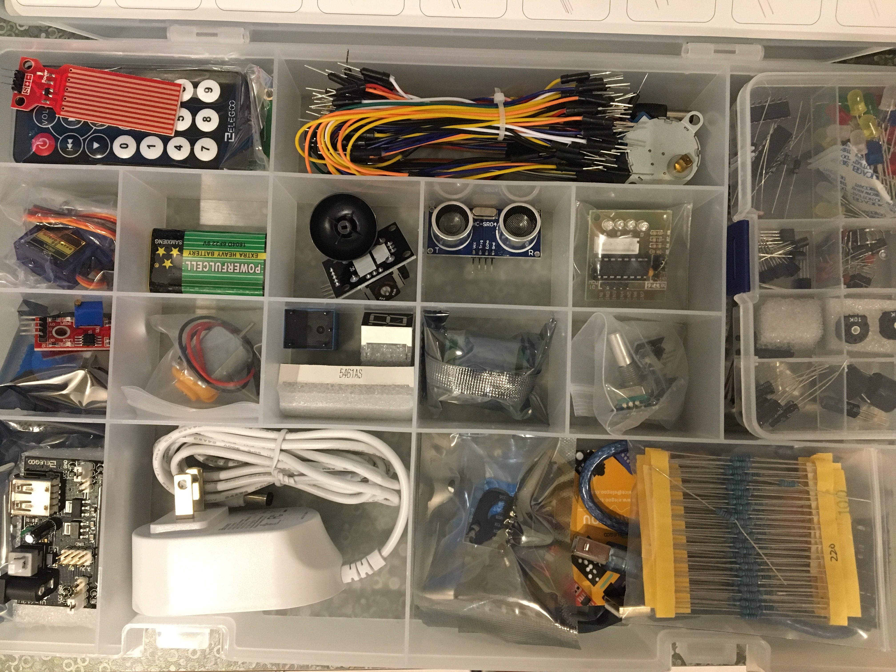
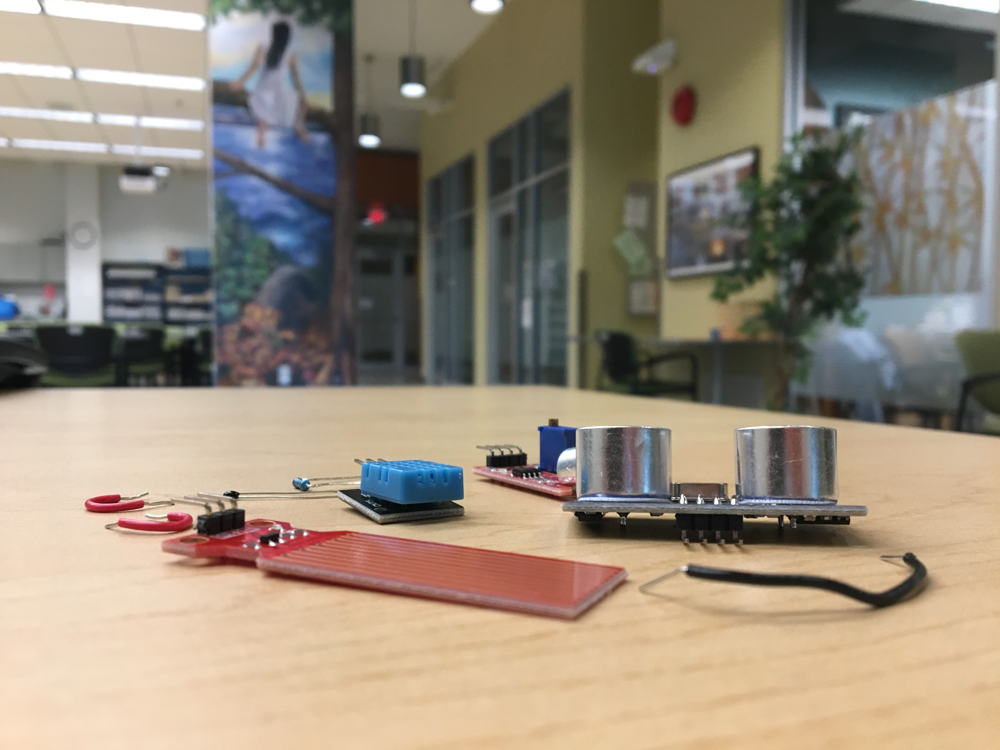

# Making DIY Sensors

Welcome to the Making DIY Sensors! Through these tutorials, you will get a chance to try your hand at creating your own data loggers using an Arduino and very simple circuitry.

To get started, check out this video.

The Arduino can act as a translator between sensors and our computer. Neat!

We will use breadboards to build our circuits. These nifty devices allow us to easily, quickly, and reliably connect different electrical components together. In this way, they are just right for connecting sensors to our Arduino.

If you're new to breadboarding, I would highly recommend watching the video below. It really breaks down breadboards in a way that is not only insightful but fascinating.

This guide includes three mini-projects, plus an extra, helpful tutorial. I highly recommend starting with Project 1. It introduces analogue sensors, along the way discussing many concepts that you will find useful in all sensor projects.

## Table of Contents

To open a section, click on the folder of the appropriate name at the top of this page.

| Section | Contents |
|-----|-----|
| Project 1: The thermistor | Analogue sensors, ADC, the Arduino IDE, uploading programs, the serial monitor, the three parts of sensor programs |
| Saving sensor data | Saving sensor data from the serial monitor to a file, opening in Excel |
| Project 2: The digital humidity-temperature sensor | Digital sensors, installing libraries |
| Project 3: Using multiple sensors | Adapting code, using multiple power buses |

&nbsp;

&nbsp;

