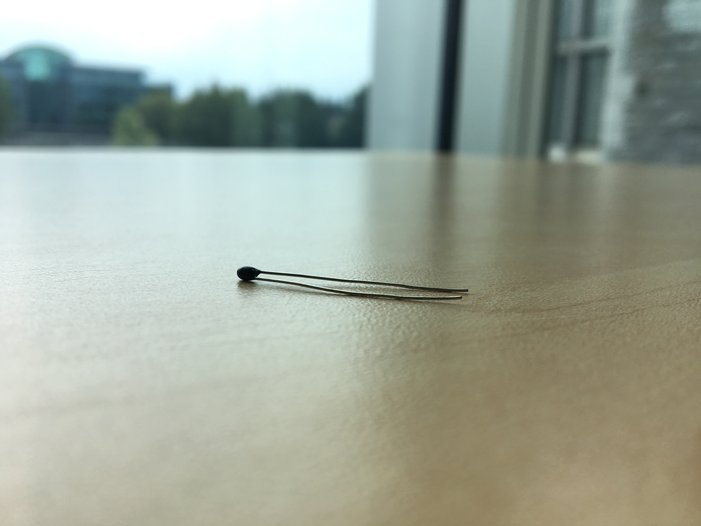

# Analogue Sensors: The Thermistor

This tutorial will introduce you to using analogue sensors. We'll also look at basic sensor code structure, the Arduino IDE, and how to view sensor data from your Arduino on your computer.

First, I will tell the story of the thermistor: what it does, how we can use it, and why we use it the way we do. If you're eager to get wiring and coding, feel free to jump down to the "Building the circuit" section.

## Theory

(i.e. the fun stuff)

### Thermistors

The thermistor is a resistor whose resistance changes with temperature. This simple property makes it an effective, durable, and cheap temperature sensor.

Thermistors come in two types:

* Negative temperature coefficient (NTC) thermistors decrease in resistance as the temperature rises.
* Positive temperature coefficient (PTC) thermistors increase in resistance as the temperature rises.

We will use an NTC thermistor for our temperature sensor.

### How we take readings

Using the thermistor to sense temperature is a three-step process. First, we read the voltage across the thermistor. Second, we use Ohm's law to calculate the resistance of the thermistor. Finally, we use the Steinhart-Hart equation to convert this resistance into a temperature.

Here is the schematic for this circuit:

A few points of note:

* We have put a 10 kΩ resistor in series with the thermistor. If we measure how much of the total voltage difference occurs across the thermistor, we can determine what fraction of the total resistance occurs through the thermistor and so calculate the thermistor's resistance. We do this by measuring the voltage between the thermistor and the resistor; hence the connection to pin A5 on the Arduino. (Any analogue pin could be used.) I will discuss this more below.
* The circuit as shown is set up to run on 3.3 V, not the usual 5 V. Either voltage will work, but [using 3.3 V may reduce noise](https://learn.adafruit.com/thermistor/using-a-thermistor).
* Connecting the 3.3 V pin to the AREF pin tells the Arduino that we are going to measure a voltage between 0 V and 3.3 V instead of between 0 V and 5 V like we normally do. If you were running on 5 V, you could omit this connection.

#### Analogue to digital conversion: How to read a voltage

In the digital world, things are either on or off, `HIGH` or `LOW`, 5 V or 0 V. With analogue components, however, voltages can take infinite values; in this case, somewhere between 0 V and 3.3 V. The Arduino represents voltages like these as a natural number between 0 and 1023, placing it on a scale between two voltages it knows. The 0 end of the scale is at 0 V. Normally, the 1023 end of the scale is at 5 V, but we will change this to 3.3 V by connecting the 3.3 V power supply to the AREF pin.

Thus, the resistance across the thermistor is given by

$$R_{thermistor} = V_{CC} \cdot \frac{V_{read}}{1023}$$

where $V_{read}$ is the number from 0 to 1023 that we get for our analogue reading and $V_{CC}$ is the power supply voltage (for us, 3.3 V).

This process is known as [Analogue to Digital Conversion (ADC)](https://en.m.wikipedia.org/wiki/Analog-to-digital_converter).

(The Arduino is said to have 10-bit ADC because there are 2^10 (1024) possible values a voltage can take.)

#### Converting from voltage to resistance

We can use [Ohm's law](https://en.m.wikipedia.org/wiki/Ohm%27s_law) to convert this voltage reading into a resistance. To do this, we will come up with two equations then combine them with the powers of algebra.

To start with, the voltage difference across the thermistor and the resistor must total $V_{CC}$, the voltage supplied by the power supply.

$$V_{thermistor} + V_{resistor} = V_{CC}$$

This is our first equation.

Next, we know that the current through the thermistor is the same as the current through the resistor.

$$I_{thermistor} = I_{resistor}$$

Ohm's law tells us that $I = \frac{\Delta V}{R}$, where $I$ is the current through a circuit component, $\Delta V$ is the voltage change across the component, and $R$ is the component's resistance. So, we get

$$\frac{V_{thermistor}}{R_{thermistor}} = \frac{V_{resistor}}{R_{resistor}}.$$

This is our second equation.

Putting these two equations together, we reach

$$R_{thermistor} = \frac{R_{resistor}}{\frac{V_{CC}}{V_{thermistor}} - 1}.$$

We're almost there! We just need one finishing touch. Adding our ADC equation from the previous section, we get

$$R_{thermistor} = \frac{R_{resistor}}{\frac{1023}{V_{read}} - 1}$$

where $V_{read}$ is the natural number from 0 to 1023 that we actually read. This is the equation we will use in our code.

#### Converting resistance to temperature

We can use the [Steinhart-Hart equation](https://en.m.wikipedia.org/wiki/Steinhart–Hart_equation) to convert our resistances into temperatures. This equation takes the form

$$\frac{1}{T} = A + B ln(R) + C ln(R)^3$$

where T is the temperature, R is the thermistor resistance, and A, B, and C are constants. For equations like this, you may be able to find values for your constants on the datasheet for the sensor. Google around a bit. For our code, we will use values from an ELEGOO tutorial using this sensor. I'm not sure where they got them, but they seem to work fairly well.

---

## Building the circuit

Let's get cracking.

Here is the circuit diagram for this project:

Go ahead and build the circuit. Then, open `proj1-thermistor.ino` and upload the program to your Arduino.

When the program is finished uploading, click the magnifying glass icon at the top right corner of the screen to open the serial monitor. You should now see temperature readings from your thermistor.

The video below walks through uploading the program to the Arduino.

<!!! Arduino IDE video>

## The code

In general, I've found that sensor programs have three main parts:

1. The Constants section, where we define constants to hold program parameters (e.g. pin numbers for connections, how long to wait between sensor readings);
2. The Functions section, where we design functions to help us read the sensors, each function doing one job; and
3. The Setup and Main Loop section, where we tell the Arduino what to do, and when.

Try to identify the three parts of sensor programs in `proj1-thermistor.ino`. As you go through the code, be sure to read the comments; use them to guide you as you follow what the code is doing.

Notice how having separate functions for reading sensors keeps the Main Loop clean and makes our code easier to reuse. Remember always the golden rule of function design: each function does one job. It should always be easy to see what the singular purpose of each function is. (What do you think the singular purpose of the Main function is?)

## Further reading

* [A good, practical guide to using thermistors](https://learn.adafruit.com/thermistor/using-a-thermistor)
* [Analogue to digital conversion – Wikipedia](https://en.m.wikipedia.org/wiki/Analog-to-digital_converter)
* [The Steinhart-Hart equation – Wikipedia](https://en.m.wikipedia.org/wiki/Steinhart–Hart_equation)
* [Ohm's Law – Wikipedia](https://en.m.wikipedia.org/wiki/Ohm%27s_law)

