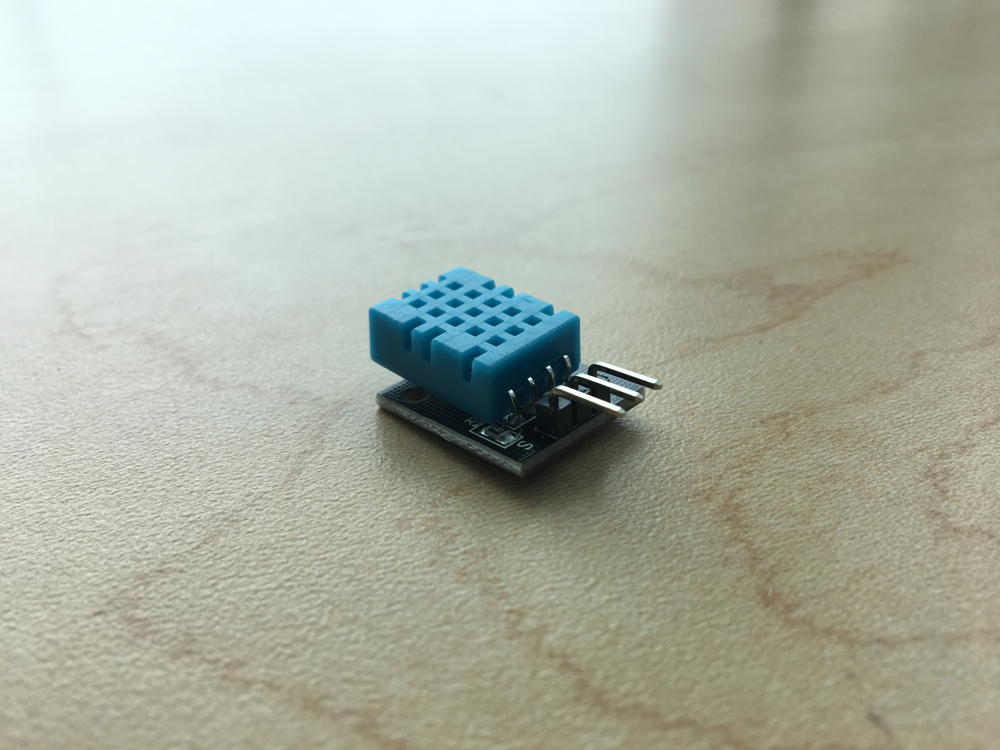
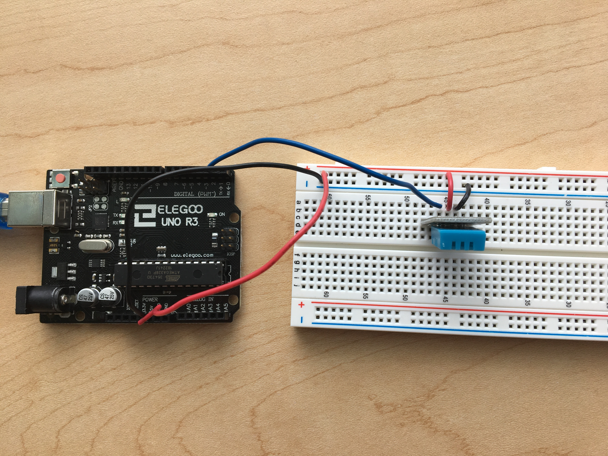
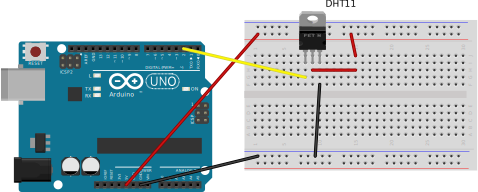

# Project 2: The digital humidity-temperature sensor

The digital humidity-temperature sensor (DHT) is an integrated circuit—that is, it contains several components packaged together into a nice, little, mini circuit for our convenience. Among other things, it contains

* A thermistor to measure temperature,
* A relative humidity sensor, and
* A microcontroller (small computer) to read these on our behalf.

We communicate with the DHT's microcontroller through a digital signal, a series of 5 V and 0 V blips. Here, there is nothing analogue for us to do; the microcontroller handles all the ADC and temperature-conversion stuff for us.

Rather than figuring out how to communicate with the DHT ourself, we will load a *library* onto our Arduino to handle this for us. A library is a bundle of code that someone else develops that we can then load and make reference to in our own programs. Most often, if you're using a digital sensor, you can find a library to help you communicate with it.

---

## Building the circuit

Let's build the circuit! Here is our circuit diagram.

As you can see, the wiring is much simpler than the analogue sensor circuit from the previous project.

The video below shows how to find and install libraries for our sensor. We will use the Adafruit Unified Sensor library and the Adafruit DHT library.

<!!! libraries video>

<iframe width="560" height="315" src="https://www.youtube-nocookie.com/embed/S3-cJ5KJq7o" frameborder="0" allow="accelerometer; autoplay; encrypted-media; gyroscope; picture-in-picture" allowfullscreen></iframe>

Notice how I was able to use the example code to figure out what I needed to include in my own program. The code is shorter than for the analogue circuit; we don't have to design functions for reading the DHT as the libraries already give us some!

Go ahead and load the `proj2-dht.ino` code onto your Arduino. You should be able to see temperature and humidity readings in the serial monitor.
