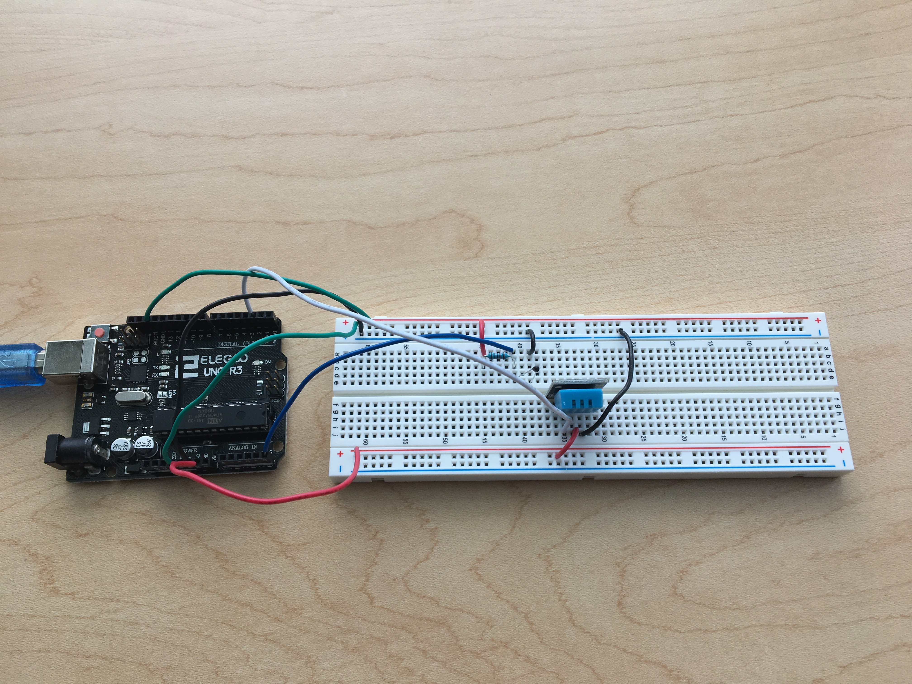
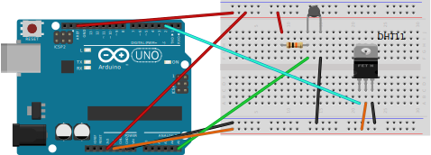

# Project 3: Multiple sensors

Here, we will combine our thermistor and DHT circuits together and get them both working at the same time.

---

## Building the circuit

There's nothing really new in this project. There are just two things worth pointing out:

* The thermistor circuit takes 3.3 V and the DHT takes 5 V. No problem—that's why we have two sets of power buses on our breadboard.
* Now we are really starting to see the payoff of using functions to compartmentalize our code. Despite all their complexity, the two programs from before were easy to combine, and the new code is still clear, largely thanks to all of our thermistor calculations being done in their own functions. The main function is left to do one thing: tell the Arduino what to do, and when. Also, notice how helpful the comments are in explaining what each bit of code does.
